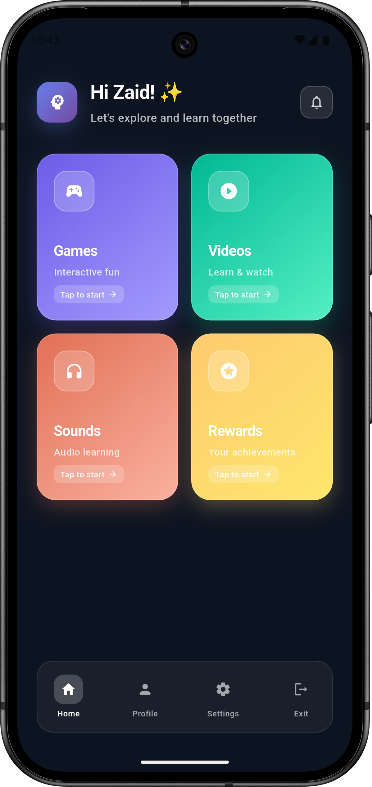
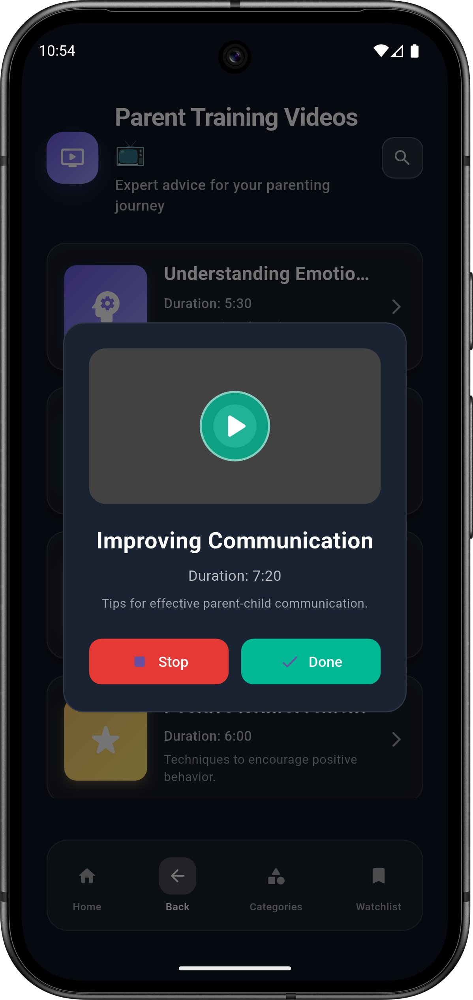

# BrightSprings 🌸 – Child Support App (ASD Assistance)

BrightSprings is a supportive application designed to assist children with **Autism Spectrum Disorder (ASD)** by providing interactive tools, structured routines, and emotional support features.  
The app focuses on improving learning, engagement, and daily life management for children and their caregivers.

---

## 🚀 Features

- 🧠 Personalized routines for children with ASD  
- 🎨 Interactive and engaging activities  
- 🔍 Progress tracking for parents/caregivers  
- 📊 Mood detection & daily reports  
- 🌐 Cross-platform accessibility  

---

## 🛠️ Tech Stack

- **Frontend:** React Native / Flutter (depending on version)  
- **Backend:** Node.js + Express  
- **Database:** Firebase / MongoDB  
- **Other Tools:** AI-driven mood detection, cloud storage  

---

## 📸 Screenshots

Below are the app screenshots (0 → 38) from the development and UI flow.  

   
    
    
    
    
    
    
    
    
    
    
    
    
    
    
    
    
    
    
    
    
    
    
    
    
    
    
    
    
    
    
    
    
    
    
    
    
    
    
    

---

## 📌 Future Plans

- AI-powered personalized suggestions  
- Gamified tasks for engagement  
- Multi-language support  
- Parent-caretaker chat module  

---

## 🤝 Contributing

We welcome contributions! Please submit pull requests or open issues.  

---

## 📧 Contact  

📩 Email: badridevelopersandsales@gmail.com  
🌐 Portfolio: https://taher-travadi-portfolio.vercel.app/
👨‍💻 GitHub: https://github.com/mercyless22/Bright-Springs

---

⭐ Don’t forget to **star the repo** if you find this project useful!

